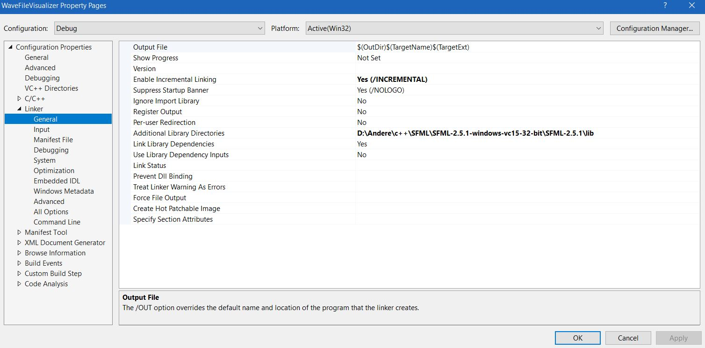

# Wave-File-Visualizer

## Setup instructions

First you need to install [sfml](https://www.sfml-dev.org/download/sfml/2.5.1/) (I downloaded visual c++ 15 32 bit), next you need to link the libraries in visual studio.
Go to Project -> properties 
and under C/C++ -> general -> Additional Include Directories you put the \include folder where you downloaded sfml.

Repeat the process for "All Options"

Next go to Linker -> General and under Additional Library Directories you put again the \include directory.

Furthermore add the following (sfml-graphics-d.lib;sfml-window-d.lib;sfml-system-d.lib;sfml-audio-d.lib;) to Linker->Input->Additional Dependencies

For the last step add the following files to the same directory where the .snl file is located.

- openal32.dll (/bin folder)
- sfml-audio-d-2.dll (/bin folder)
- sfml-system-d-2.dll (/bin folder)
- sfml-window-d-2.dll (/bin folder)

You might also need to change the solution platform to x86 instead of x64.